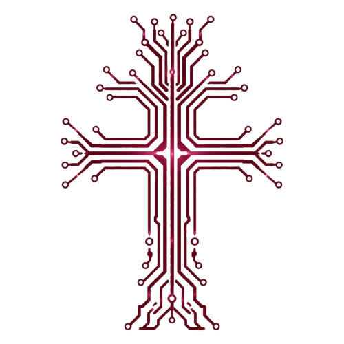
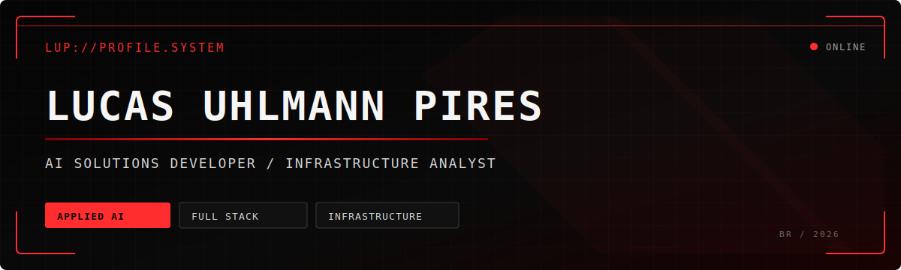
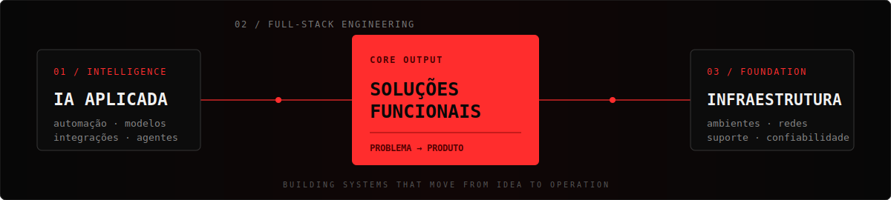

<!--
  README de perfil — Lucas Uhlmann Pires
  Antes de publicar, substitua os 3 links marcados com "ALTERAR".
-->

<div align="center">
  
  <br />
  <samp>ROOTED IN SYSTEMS · BUILT TO EVOLVE</samp>
</div>

<br />

<div align="center">
  
</div>

<div align="center">
  <a href="https://github.com/lucaspiress?tab=followers"></a>
  
</div>

<br />

## `> whoami`

Sou estudante de **Sistemas de Informação no IFFar**, desenvolvedor de soluções orientadas por IA e analista de infraestrutura. Transformo problemas reais em aplicações completas, combinando automação inteligente, desenvolvimento web e uma base técnica confiável.

_I am an Information Systems student at IFFar, AI solutions developer, and infrastructure analyst. I turn real-world problems into complete applications by combining intelligent automation, web development, and reliable infrastructure._

```text
FOCO ATUAL      soluções aplicadas com IA
CONSTRUINDO     RotaCAD + sistema de gestão financeira
APRENDENDO      arquitetura, automação e produtos digitais
PRÓXIMO PASSO   meu portfólio pessoal
```

<div align="center">
  
</div>

## `> stack --list`

<div align="center">
  
</div>

<br />

| Área / Area | Tecnologias / Technologies |
|:--|:--|
| **IA & Automação** | Python, integração de modelos e automação de processos |
| **Front-end** | React, Next.js, JavaScript, HTML e CSS |
| **Back-end & Dados** | Node.js, PHP e MySQL |
| **Infraestrutura** | ambientes, redes, suporte e confiabilidade operacional |

## `> projects --featured`

<table>
  <tr>
    <td width="50%" valign="top">
      <h3>📐 RotaCAD</h3>
      <p>Software técnico em desenvolvimento para criação e edição de projetos, combinando geometria, automação e uma experiência visual eficiente.</p>
      <p><em>Technical software for creating and editing projects, combining geometry, automation, and an efficient visual workflow.</em></p>
      
      
    </td>
    <td width="50%" valign="top">
      <h3>💳 Sistema de Gestão Financeira</h3>
      <p>Aplicação para organizar receitas, despesas e informações financeiras, transformando dados do dia a dia em uma visão clara para tomada de decisões.</p>
      <p><em>An application that turns everyday financial data into a clear view for organization and decision-making.</em></p>
      
      
    </td>
  </tr>
</table>

> Alguns projetos ainda estão em desenvolvimento ou mantidos em repositórios privados. Estudos e novas versões públicas serão adicionados em breve.

## `> github --stats`

<div align="center">
  
  
</div>

<div align="center">
  
</div>

<picture>
  <source media="(prefers-color-scheme: dark)" srcset="https://raw.githubusercontent.com/lucaspiress/lucaspiress/output/github-contribution-grid-snake-dark.svg" />
  <source media="(prefers-color-scheme: light)" srcset="https://raw.githubusercontent.com/lucaspiress/lucaspiress/output/github-contribution-grid-snake.svg" />
  
</picture>

## `> connect --open`

Estou aberto a colaborar em projetos que envolvam **IA aplicada, automação, desenvolvimento de produtos web e infraestrutura**.

_Open to collaborating on projects involving **applied AI, automation, web product development, and infrastructure**._

<div align="center">
  <a href="https://github.com/lucaspiress">GitHub</a>
  ·
  <strong>Portfólio — em desenvolvimento</strong>
</div>

<!-- Adicione aqui seus links de LinkedIn, Instagram e e-mail quando estiverem definidos. -->

<br />

<div align="center">
  
  <br /><br />
  
  <br />
  <sub><samp>LUP://SYSTEMS · IDEIAS COM RAÍZES, TECNOLOGIA EM EXPANSÃO</samp></sub>
</div>
