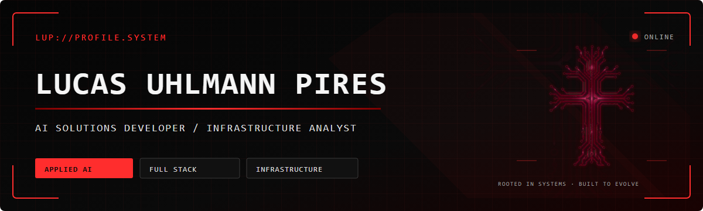

  

 

  

  

  

  

 

## Sobre mim

Tenho formação técnica em **Informática pelo IFFar** e experiência com desenvolvimento de sistemas, suporte técnico e infraestrutura.

Atualmente, concentro meus estudos e projetos em **inteligência artificial aplicada, automação e desenvolvimento web**, buscando transformar problemas reais em soluções funcionais, bem estruturadas e úteis.

Meu foco não está apenas em aprender novas ferramentas, mas em utilizá-las para desenvolver produtos, melhorar processos e construir projetos com aplicação prática.

  

 

## Tecnologias

  

 

| Área | Tecnologias e conhecimentos |
|:--|:--|
| **Inteligência Artificial e Automação** | Python, integração de modelos de IA, engenharia de prompts e automação de processos |
| **Front-end** | React, Next.js, JavaScript, HTML e CSS |
| **Back-end e Dados** | Node.js, PHP, MySQL, APIs e modelagem de dados |
| **Infraestrutura** | Redes, manutenção de computadores, suporte técnico e ambientes de TI |
| **Desenvolvimento de Produtos** | Levantamento de requisitos, prototipação, testes, documentação e evolução de sistemas |

 

## Projetos em desenvolvimento

### 📐 RotaCAD

Editor técnico para criação de plantas e diagramas voltados a projetos de segurança eletrônica.

O sistema reúne edição visual, posicionamento de equipamentos, organização de projetos, geração de documentos e recursos de automação.

---

### 💳 Sistema de Gestão Financeira

Aplicação para centralizar receitas, despesas, indicadores e informações financeiras.

O objetivo é oferecer uma visão mais clara dos dados e apoiar a organização e a tomada de decisões.

> Parte dos projetos está em desenvolvimento ou mantida em repositórios privados. Novas versões públicas e estudos técnicos serão adicionados conforme forem concluídos.

 

## Estatísticas do GitHub

  

  

 

  

 

<picture>
  <source
    media="(prefers-color-scheme: dark)"
    srcset="https://raw.githubusercontent.com/lucaspiress/lucaspiress/output/github-contribution-grid-snake-dark.svg"
  />

  <source
    media="(prefers-color-scheme: light)"
    srcset="https://raw.githubusercontent.com/lucaspiress/lucaspiress/output/github-contribution-grid-snake.svg"
  />

  
</picture>

 

## Contato

  

  

  

 

  <strong>Instagram:</strong> em breve
  &nbsp;•&nbsp;
  <strong>Portfólio:</strong> em desenvolvimento

 

  

    

  

