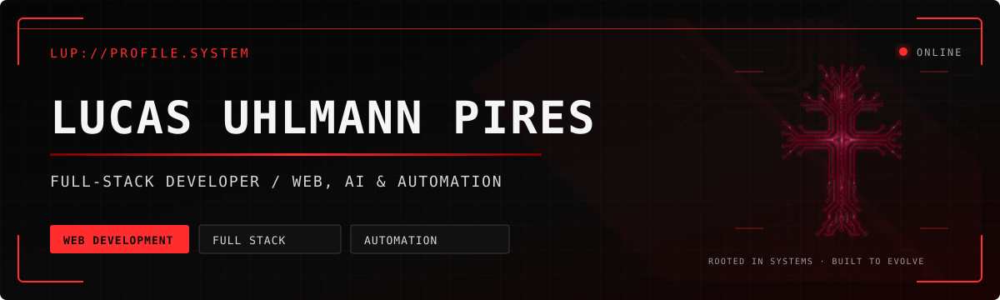
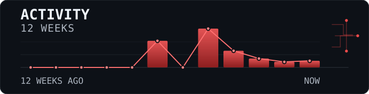

<p align="center">
  
</p>

## 01 / SYSTEM.PROFILE

```text
lucaspiress@github:~$ ./profile --boot

SYSTEM      PROFILE
SUBJECT     Lucas Uhlmann Pires
ROLE        Full-stack Developer
LOCATION    São Borja, RS · Brazil
FOCUS       Web Development · AI · Automation
STATUS      Building · Learning · Shipping
```

> systems online

Técnico em Informática pelo IFFar e desenvolvedor full-stack.

Construo aplicações web, automações e sistemas orientados a problemas reais — da interface e modelagem de dados até APIs, testes, documentação e infraestrutura.

```text
OPERATING.PRINCIPLES

[01] ship useful things
[02] automate repetitive work
[03] keep systems understandable
[04] test what matters
[05] document decisions
```

## 02 / FEATURED.SYSTEMS

### [01] RotaCAD // PRIMARY SYSTEM

```text
STATUS      ● ACTIVE
CLASS       FEATURED / PRIVATE
TYPE        Technical design system
DOMAIN      Electronic security projects
```

Editor técnico para criação de plantas e diagramas voltados a projetos de segurança eletrônica.

O sistema transforma um fluxo técnico tradicional em uma experiência visual estruturada, com edição de planta, equipamentos, persistência de projetos e geração de documentos.

```text
CORE.MODULES
├── Visual editor
├── Technical components
├── Project persistence
├── PDF generation
└── Automation
```

### [02] [Custo Dashboard](https://github.com/lucaspiress/custo-dashboard)

```text
STATUS      ● SHIPPED
TYPE        Cost management platform
STACK       React · TypeScript · FastAPI · Neon Postgres
```

Plataforma para organização e análise de custos de projetos, com dados isolados por projeto, planilhas, indicadores e dashboards.

```text
MODULES
├── React frontend
├── FastAPI backend
├── PostgreSQL persistence
├── Dashboard builder
└── Automated persistence
```

### [03] Sistema de Gestão Financeira

```text
STATUS      ● IN DEVELOPMENT
TYPE        Personal finance platform
FOCUS       Cash flow · Indicators · Organization
ACCESS      No public repository linked
```

Aplicação para centralizar receitas, despesas, indicadores e informações financeiras em uma única interface.

## 03 / STACK.INSPECT

```text
lucaspiress@github:~$ stack --inspect

FRONTEND
├── React
├── Next.js
├── TypeScript
├── JavaScript
├── HTML
└── CSS

BACKEND
├── Python
├── FastAPI
├── Node.js
├── PHP
└── REST APIs

DATA
├── PostgreSQL
├── Neon
├── MySQL
└── Data modeling

AUTOMATION
├── Python
├── AI model integration
├── Prompt engineering
└── Process automation

ENGINEERING
├── Git
├── GitHub Actions
├── Testing
├── Documentation
└── Requirements
```

## 04 / BUILD.SIGNAL

```text
lucaspiress@github:~$ telemetry --stream build.signal
```



## 05 / SYSTEM.STATUS

```text
SYSTEM STATUS
────────────────────────────────────

PROJECTS      ● ACTIVE
LEARNING      ● CONTINUOUS
AUTOMATION    ● ENABLED
SHIPPING      ● ENABLED

HEALTH        ALL SYSTEMS OPERATIONAL
```

```text
CURRENT OBJECTIVE

Build products that are useful,
understandable and capable of evolving.
```

## 06 / NETWORK

[`> github.connect()`](https://github.com/lucaspiress)

[`> linkedin.connect()`](https://www.linkedin.com/in/lucasuhlmann/)

```text
lucaspiress@github:~$ _
```
