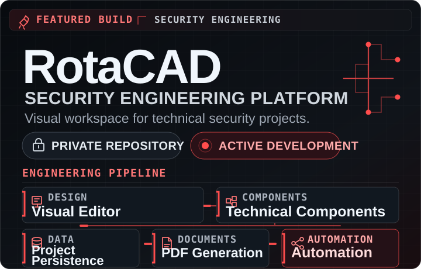
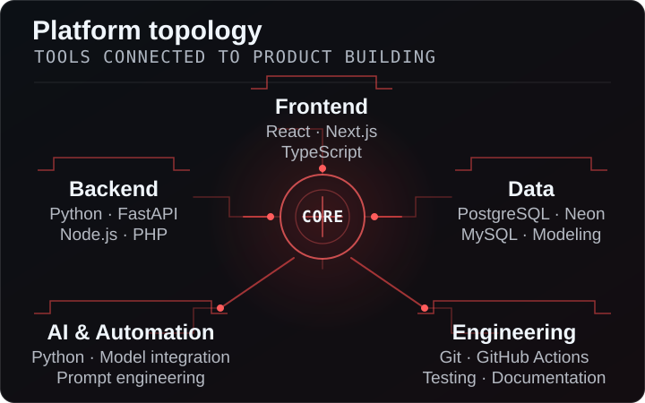

  

  <strong>Full-stack developer construindo produtos web, automações e sistemas de IA aplicados a problemas reais.</strong> 
  São Borja, RS · Brazil  
  <a href="https://github.com/lucaspiress">GitHub</a>
  &nbsp;·&nbsp;
  <a href="https://www.linkedin.com/in/lucasuhlmann/">LinkedIn</a>

 

## 🛡️ RotaCAD

  

### Do desenho ao documento técnico

**Editor visual para criação de plantas, posicionamento de equipamentos e documentação técnica.**

Do desenho ao PDF, o RotaCAD organiza o fluxo de projeto em uma única plataforma.

**🔒 Repositório privado** · **⚙️ Desenvolvimento ativo**

 

## Other builds

### [Custo Dashboard](https://github.com/lucaspiress/custo-dashboard)

Dashboard para análise e gerenciamento de custos de projetos.

React · TypeScript · FastAPI · Python · Neon Postgres

### Sistema de Gestão Financeira

Aplicação em desenvolvimento para centralizar receitas, despesas, indicadores e informações financeiras.

 

## Platform toolkit

  

 

## Activity

  

 

  <a href="https://github.com/lucaspiress">GitHub</a>
  &nbsp;·&nbsp;
  <a href="https://www.linkedin.com/in/lucasuhlmann/">LinkedIn</a>

